## 登录ESXI

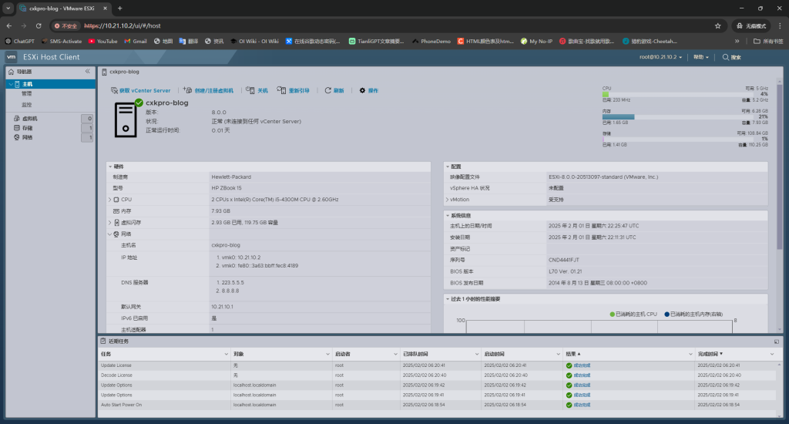

## 更改ESXI配置文件

### 进入维护模式&&开启SSH

在`管理`->`硬件`的PCI设备中找到待`NVIDIA`的`PCI`设备
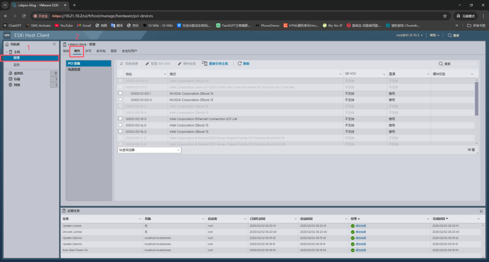

勾选待`NVIDIA`的`PCI`设备，然后选择`切换直通`
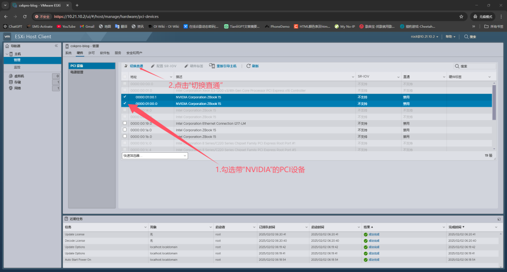

切换直通后，会显示：
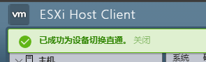

进入维护模式：`主机`->`操作`->`进入维护模式`

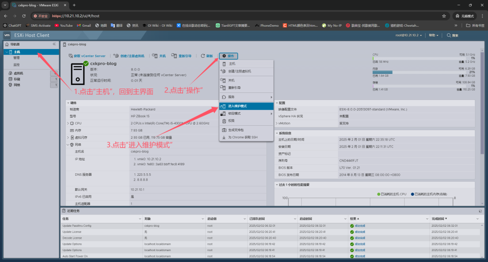

然后在`管理`→`服务`，开启`SSH`服务

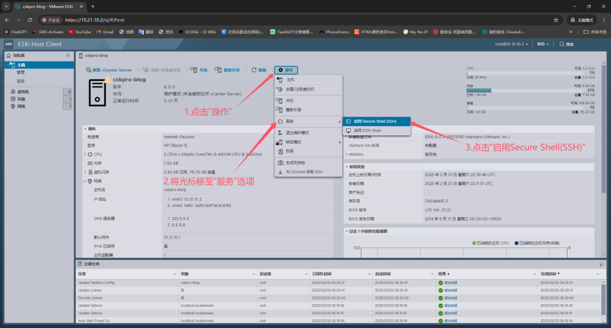

## 进入SSH

打开终端并使用SSH连接到服务器

此时，你需要记住显卡的PCI地址。

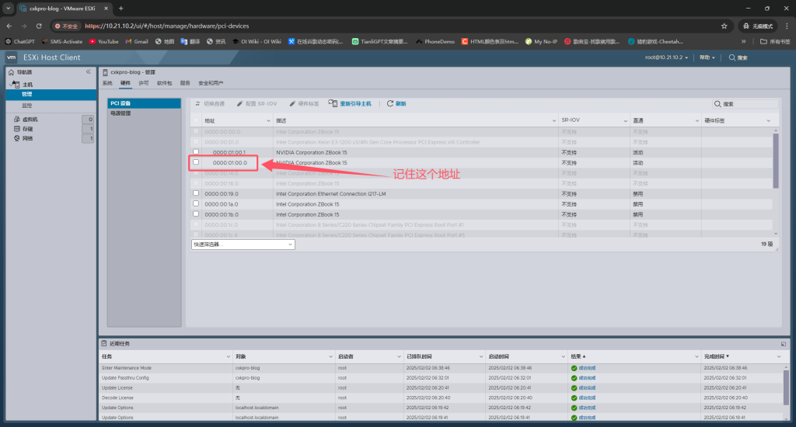

# 修改配置文件

输入`vi /etc/vmware/esx.conf`
```
vi /etc/vmware/esx.conf
```

在最后一行添加 `/device/0000:01:00.0/owner = “passthru”`

```
/device/0000:01:00.0/owner = “passthru”

# 将”0000:01:00.0″改为你显卡的PCI设备路径
```

修改完成后，输入`“wq“`保存

退出之后，输入`vi /etc/vmware/passthru.map`

```
vi /etc/vmware/passthru.map
```

在`# NVIDIA`处，添加以下内容：

```
10de ffff bridge false
10de ffff link false
10de ffff d3d0 false
10de 11c6 bridge false
10de 11c6 link false
10de 11c6 d3d0 false
```

输入`“wq“`保存

然后重新引导ESXI
```
reboot
```

重启之后，我们就可以添加虚拟机了

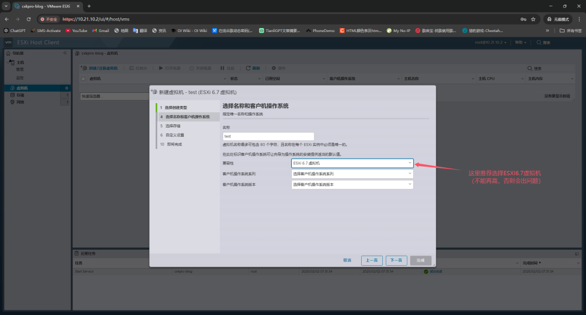

虚拟机兼容性推荐为ESXI6.7版本（不能选高版本！！）

然后内存→预留所有客户机内存(全部锁定)，必须勾选

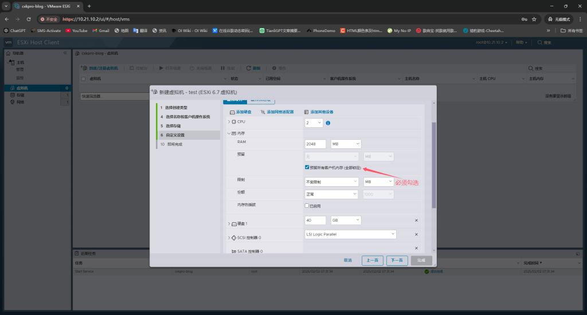

还需要添加一条规则。

进入`虚拟机选项` → `高级` → `编辑配置`

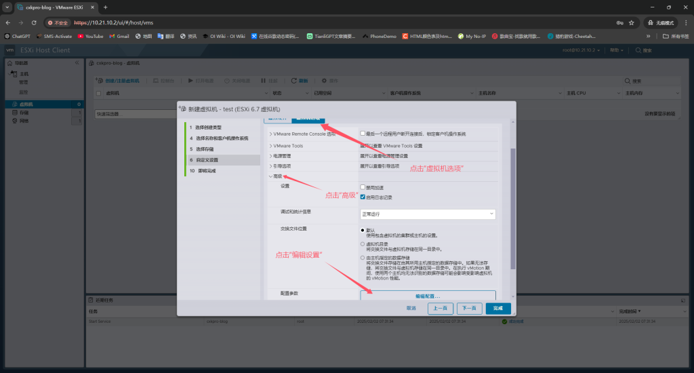

在配置参数里面添加以下内容：

```
hypervisor.cpuid.v0 = FALSE
```

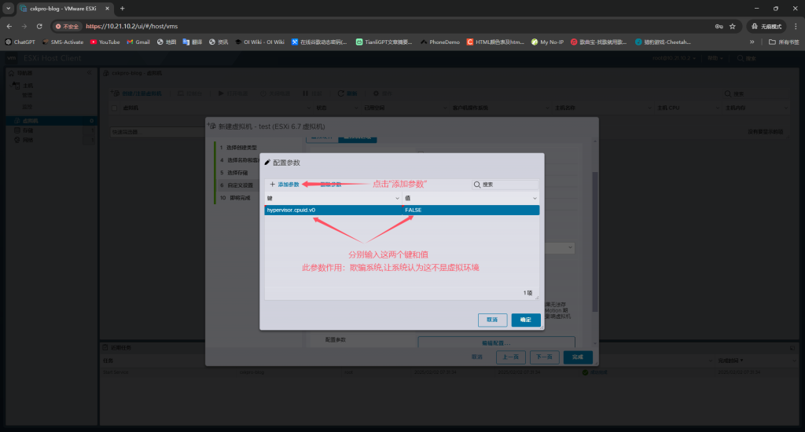

配置完之后，在虚拟机里面添加PCI设备，添加完成后正常安装系统，然后把显卡驱动装上即可食用。