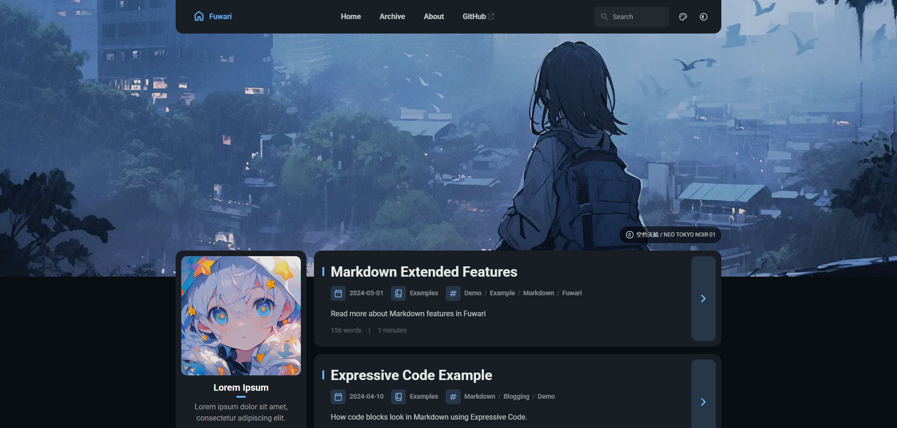
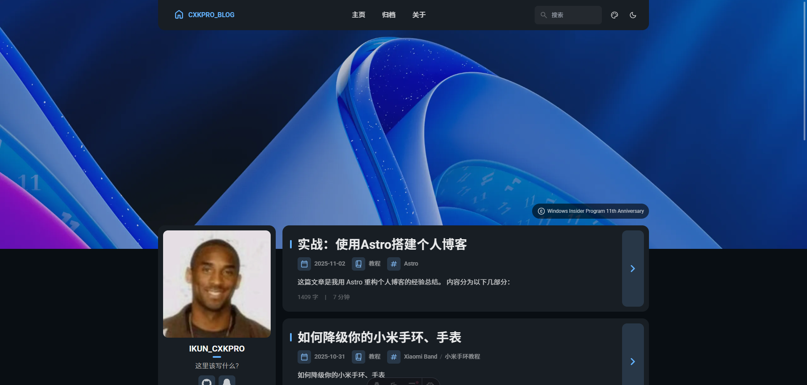
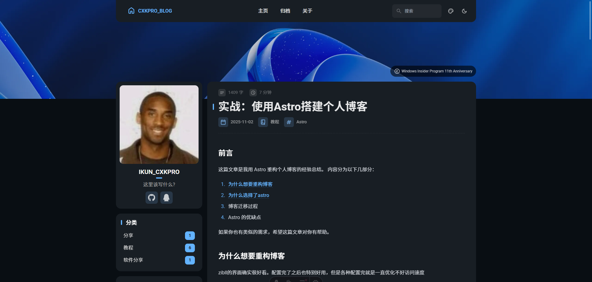
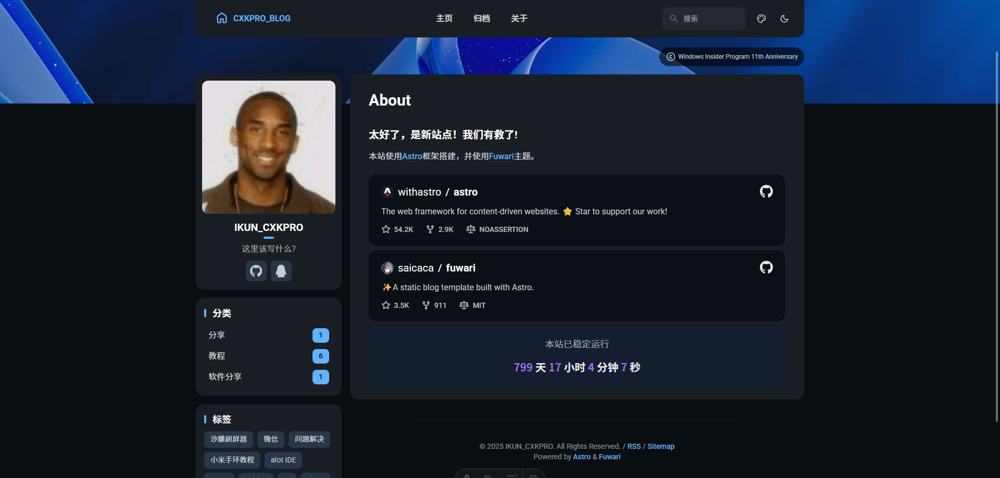

## 前言
这篇文章是我用 Astro 重构个人博客的经验总结。
内容分为以下几部分：

1. [为什么想要重构博客](#为什么想要重构博客)
2. [为什么选择了astro](#为什么选择了astro)
3. [博客迁移过程](#博客迁移过程)
4. [Astro 的优缺点](#astro的优缺点)

如果你也有类似的需求，希望这篇文章对你有帮助。

## 为什么想要重构博客
zibll的界面确实很好看。配置完了之后也特别好用，但是各种配置完就是一直优化不好访问速度  

主要原因还是因为优化不好，而且优化很麻烦，且必须加cdn速度才能上来。  

第二个就是续费不起cdn，用cf的cdn速度特别慢,甚至有些地方无法访问。  

还有一个原因是希望了解下时下流行的 Island 架构，并且借助这次重构，尝试找到比较便捷的高性能内容站点解决方案。

## 为什么选择了Astro
关注 Astro 其实有段时间了，但由于当时的网站还很稳定，所以并没有怎么去研究  

最近QQ群里有不少人用 Astro 改写了自己的博客或者是其它类型的内容站点，风评很好。看了官方文档之后，确实和我之前理解的不同，Astro 会更专注在内容站点，而 Next.js 更偏向于构建 Web APP。  

尝试了跑了一个 demo 之后，发现上手特别简单，技术栈很熟悉。  

默认支持 Markdown 和 MDX 的渲染，挺不错的。但是由于之前的博客使用的是wordpress，而且我之前压根没写过md，所以想试试使用Astro来重构博客，看看效果怎么样，结果就是 特别好。  

接下来 说干就干。

## 博客迁移过程

### 搭建Astro
首先：新建个文件夹。
这里我是直接使用了[Fuwari](https://github.com/saicaca/fuwari)主题  
::github{repo="saicaca/fuwari"}  

直接把项目源代码给fork一下，解压到你的项目文件夹  
然后在项目文件夹下运行`pnpm install`和`pnpm add sharp`，安装一下依赖。  
然后就可以食用了。


### 配置Astro网站设置
这个挺简单的，在`src/config.js`文件中，修改一下网站的相关信息就行了。  
配置文件的结构，我拿manus简单画了下结构图，如下：
```
配置文件
 |- siteConfig (网站配置)
 |   |- title (网站标题)
 |   |- subtitle (网站副标题)
 |   |- lang (语言)
 |   |- themeColor (主题颜色)
 |   |   |- hue (色相)
 |   |   '- fixed (是否固定)
 |   |- banner (顶部横幅)
 |   |   |- enable (是否启用)
 |   |   |- src (图片路径)
 |   |   |- position (图片位置)
 |   |   '- credit (图片署名)
 |   |       |- enable (是否显示署名)
 |   |       |- text (署名文字)
 |   |       '- url (署名链接)
 |   |- toc (文章目录)
 |   |   |- enable (是否启用)
 |   |   '- depth (显示深度)
 |   '- favicon (网站图标)
 |
 |- navBarConfig (导航栏配置)
 |   '- links (链接列表)
 |       |- (预设链接: Home, Archive, About)
 |       '- (自定义链接)
 |           |- name (链接名称)
 |           |- url (链接地址)
 |           '- external (是否为外部链接)
 |
 |- profileConfig (个人资料配置)
 |   |- avatar (头像路径)
 |   |- name (昵称)
 |   |- bio (个人简介)
 |   '- links (社交链接列表)
 |       |- name (平台名称)
 |       |- icon (图标代码)
 |       '- url (个人主页链接)
 |
 |- licenseConfig (许可证配置)
 |   |- enable (是否启用)
 |   |- name (许可证名称)
 |   '- url (许可证链接)
 |
 '- expressiveCodeConfig (代码高亮配置)
     '- theme (代码高亮主题)

```  

这里放一下我的配置文件，仅供参考：
```
/*

./src/config.ts
最后修改:2025/11/2 16:27

*/
import type {
	ExpressiveCodeConfig,
	LicenseConfig,
	NavBarConfig,
	ProfileConfig,
	SiteConfig,
} from "./types/config";
import { LinkPreset } from "./types/config";

export const siteConfig: SiteConfig = {
	title: "CXKPRO_BLOG",
	subtitle: "主页",
	lang: "zh_CN", // 语言代码, 例如 'en', 'zh_CN', 'ja' 等
	themeColor: {
		hue: 250, // 主题色的默认色相，范围从 0 到 360。例如 red: 0, teal: 200, cyan: 250, pink: 345
		fixed: false, // 对访问者隐藏主题颜色选择器
	},
	banner: {
		enable: true,
		src: "assets/images/banner.png", // 相对于 /src 目录。如果以 '/' 开头，则相对于 /public 目录
		position: "top", // 相当于 object-position，仅支持 'top', 'center', 'bottom'。默认为 'center'
		credit: {
			enable: true, // 显示横幅图片的署名文本
			text: "Windows Insider Program 11th Anniversary", // 要显示的署名文本
			url: "https://www.microsoft.com/zh-cn/windowsinsider/articles/celebrating-11-years-together", // (可选) 指向原始艺术作品或艺术家页面的 URL 链接
		},
	},
	toc: {
		enable: true, // 在文章右侧显示目录
		depth: 2, // 目录中显示的最大标题深度，范围从 1 到 3
	},
	favicon: [
		// 将此数组留空以使用默认的 favicon
		// {
		//   src: '/favicon/icon.png',    // favicon 的路径，相对于 /public 目录
		//   theme: 'light',              // (可选) 'light' 或 'dark'，仅在您为亮色和暗色模式设置了不同的 favicon 时使用
		//   sizes: '32x32',              // (可选) favicon 的尺寸，仅在您有不同尺寸的 favicon 时设置
		// }
	],
};

export const navBarConfig: NavBarConfig = {
	links: [
		LinkPreset.Home,
		LinkPreset.Archive,
		LinkPreset.About,
		// {
		// 	name: "GitHub",
		// 	url: "https://github.com/saicaca/fuwari", // 内部链接不应包含基础路径 ，因为它会自动添加
		// 	external: true, // 显示外部链接图标，并将在新标签页中打开
		// },
	],
};

export const profileConfig: ProfileConfig = {
	avatar: "assets/images/CXKPRO.png", // 相对于 /src 目录。如果以 '/' 开头，则相对于 /public 目录
	name: "IKUN_CXKPRO",
	bio: "这里该写什么?",
	links: [
		// {
		// 	name: "Twitter",
		// 	icon: "fa6-brands:twitter", // 访问 https://icones.js.org/ 获取图标代码
		// 	// 如果某个图标集未被包含 ，您需要手动安装
		// 	// `pnpm add @iconify-json/<icon-set-name>`
		// 	url: "https://twitter.com",
		// },
		{
			name: "GitHub",
			icon: "fa6-brands:github",
			url: "https://github.com/IKUN-CXKPRO",
		},
		{
			name: "QQ",
			icon: "fa6-brands:qq",
			url: "https://wpa.qq.com/msgrd?v=3&uin=3078517671&site=qq&menu=yes",
		},
	],
};

export const licenseConfig: LicenseConfig = {
	enable: true,
	name: "CC BY-NC-SA 4.0",
	url: "https://creativecommons.org/licenses/by-nc-sa/4.0/",
};

export const expressiveCodeConfig: ExpressiveCodeConfig = {
	// 注意：某些样式（例如背景颜色 ）已被覆盖，请参阅 astro.config.mjs 文件。
	// 请选择一个暗色主题，因为本博客主题目前仅支持暗色背景
	theme: "github-dark",
};

```

文章的位置：`/src/content/posts`  
about页面: `/src/content/spec/about.md`

简单设置一下就能用了。
  
  
  

### 迁移文章
简单搜索了一下，看起来很简单。
.png)  
点进去看了下：
.png)  
好的。看不懂。

于是，我又搜索了一下html转MarkDown的相关内容，结果没有。找不到，只有md转html。。。
所以我还是选择了手动迁移的方式。

大概搞了1天左右，把部分文章先给补档上去了。
<details> <summary>期间遇到的申金问题</summary>
1.旧站挂了。
2.数据库连接完之后发现图片全部无法访问。
3.因为忘记了紧急登录地址而无法登录。连登录界面都不给我进。。
</details>

## Astro的优缺点
预先说明：Astro 框架默认依赖是很少的，TailwindCSS 等能力是 Astro Paper 这个主题内置的，非必需。

### 优点
1. 开箱即用，常见的 RSS、Sitemap 等能力都很容易集成
2. 默认支持 SSG，没有 JavaScript 依赖，页面加载和渲染非常快
3. 类型安全，Markdown 文件的 frontmatter 可以用 Schema 来约束，背后是基于 Zod 的类型校验
4. 支持集成 Typescript、React、TailwindCSS 等常见技术栈，定制起来更顺手
5. .astro 页面有点像 Vue 的单页面模版，可以很简单的实现数据的获取和转换，并且可以通过 JSX 的方式互相引用
6. 绝大部分功能逻辑都由自己掌控，相较于 Hexo 主题的黑盒逻辑，定制更容易

### 缺点
1. 构建会比之前略慢，但基于自动的流程，影响可以忽略不计
2. 没发现页面模版的能力
3. TailwindCSS 和其中的的 Typography 插件的代码写起来可读性很差
4. 没了自动生成永久 slug 的能力，需要自己写一个具有语义的名称，但 url 可读性好一些

最重要的收获：基于 Astro 框架，能够快速上线、高性能内容站点，并且用很低的成本持续管理内容。