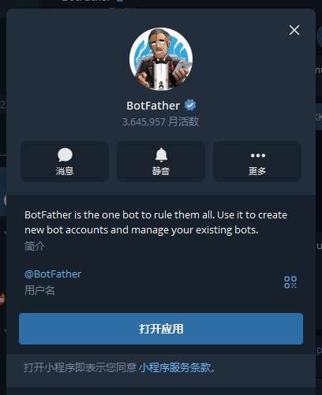
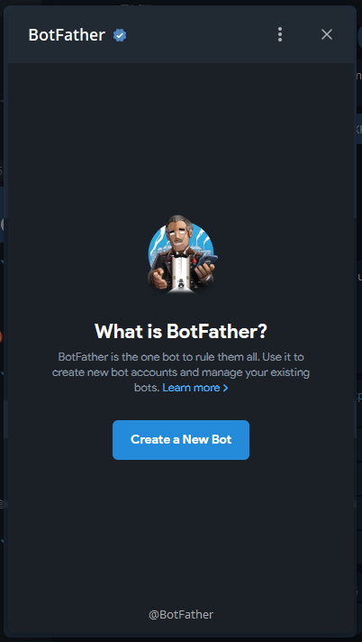
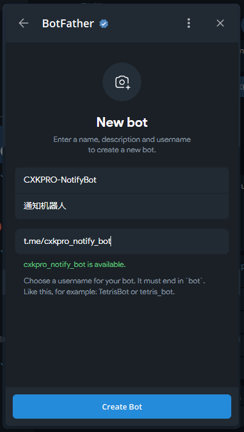
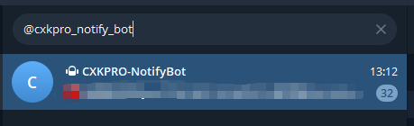
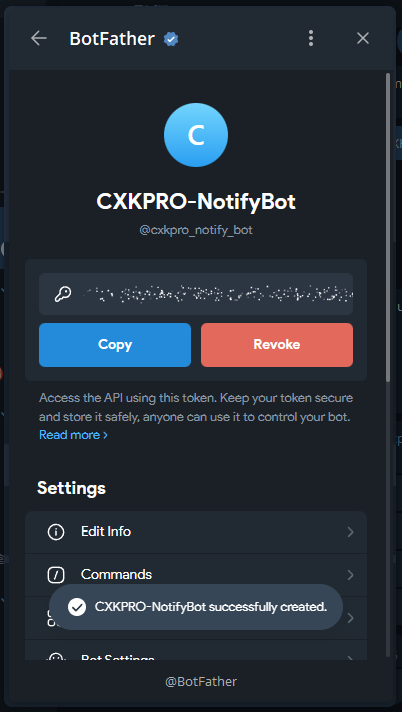
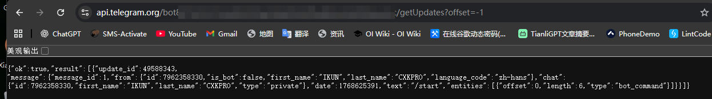
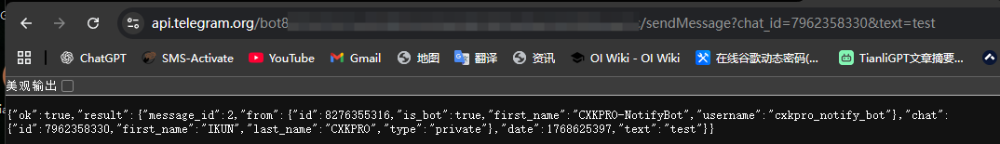
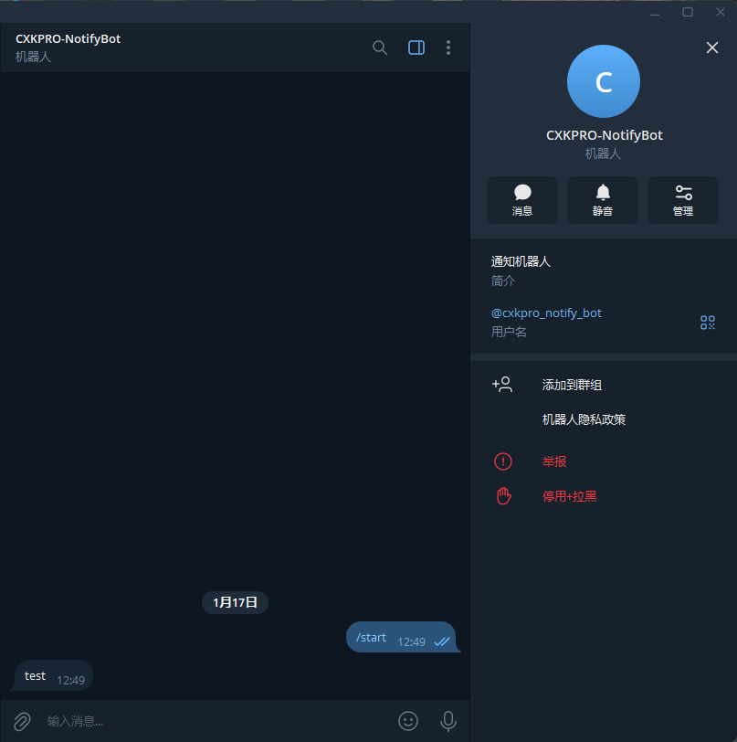
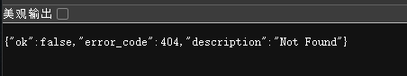

# 添加bot
首先，添加Telegram机器人之父:BotFather

然后打开小程序，创建bot

点击`Create a New Bot`

输入机器人的相关信息（昵称、id、描述）  

> [!NOTE]
> id需要以bot为结尾（例如t.me/xxxxxxx_bot）  

然后去添加一下机器人

给机器人发条消息

# 测试&获取id

copy一下token

浏览器访问`https://api.telegram.org/bot< token>/getUpdates?offset=-1`  
> [!NOTE]
> 请将"< token>"替换为实际的token值

然后就可以看到目前的消息记录了，复制一下chatid

# 机器人发送消息给特定chatid

浏览器访问:`https://api.telegram.org/bot< token>/sendMessage?chat_id=< chatid>&text=test`  
> [!NOTE]
> 请将"< token>"和"< chatid>"替换为实际的token值和chatid值

正确发送之后会返回以下信息：

此时你就可以收到bot给你发来的消息了

# 排查错误

如果以上操作搞完结果提示`{"ok":false,"error_code":404,"description":"Not Found"}`

请检查是否把< token>给完整替换成token。  
例如: token为`114514:Homo`,ChatID为`114514`则改为:
`https://api.telegram.org/bot114514:Homo/sendMessage?chat_id=114514&text=test`